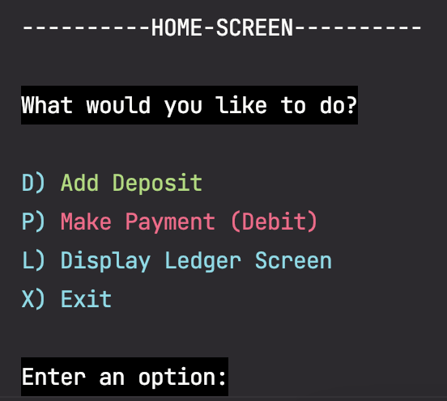
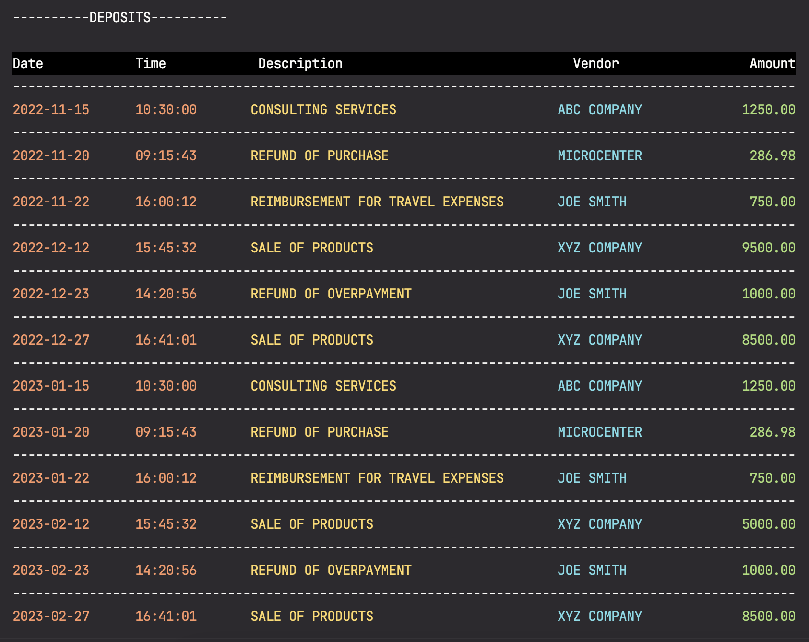
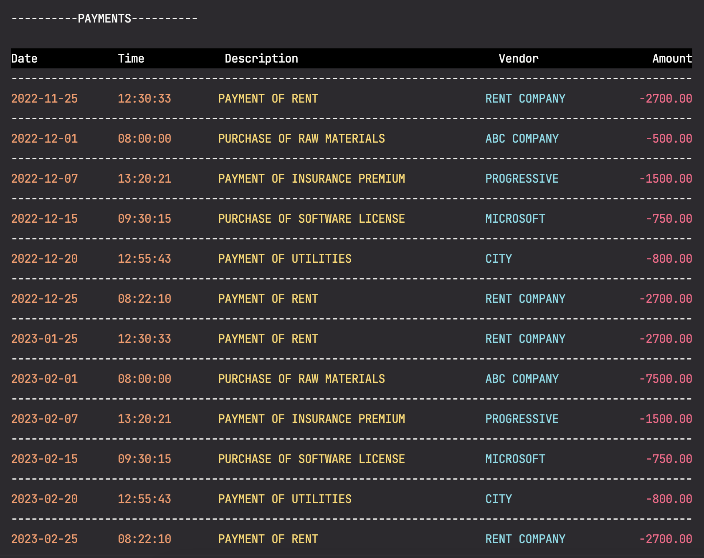
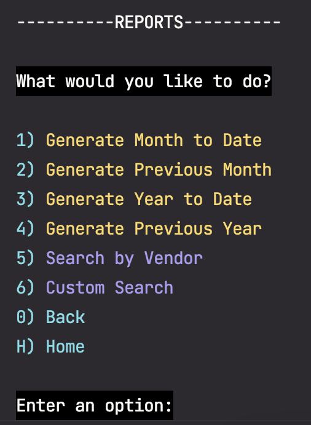
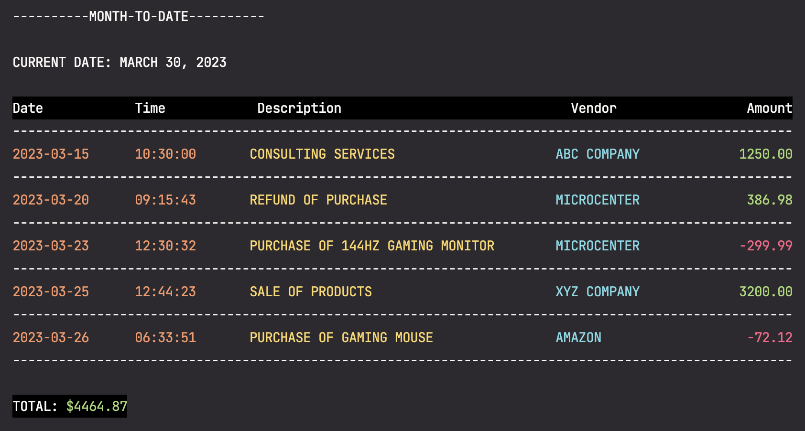
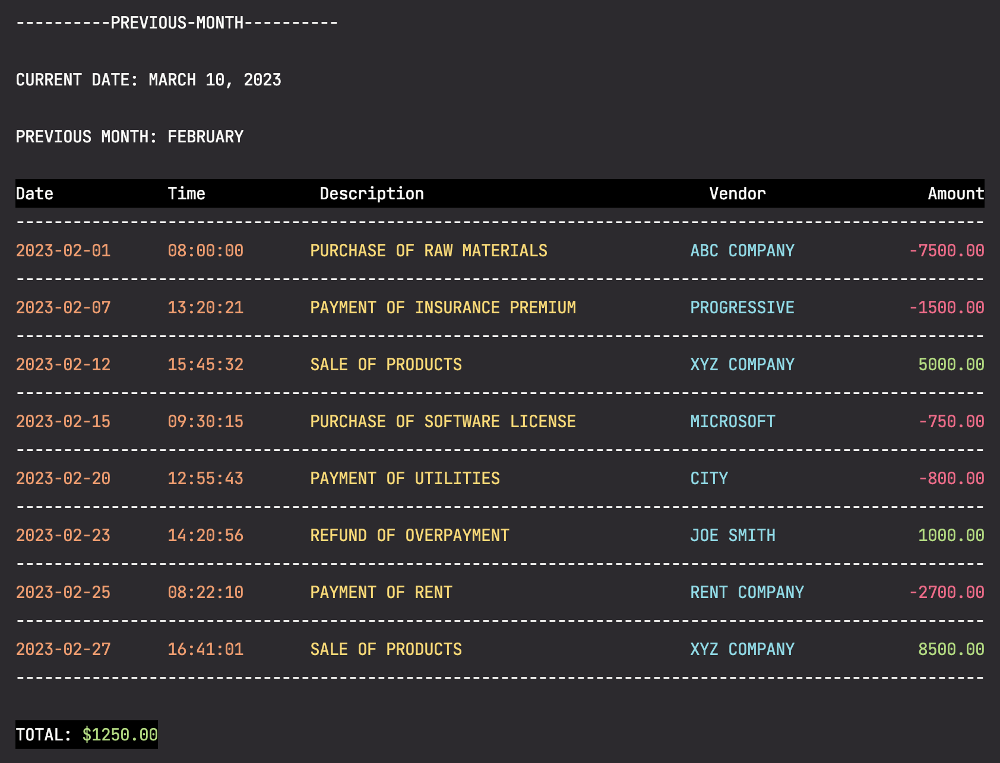
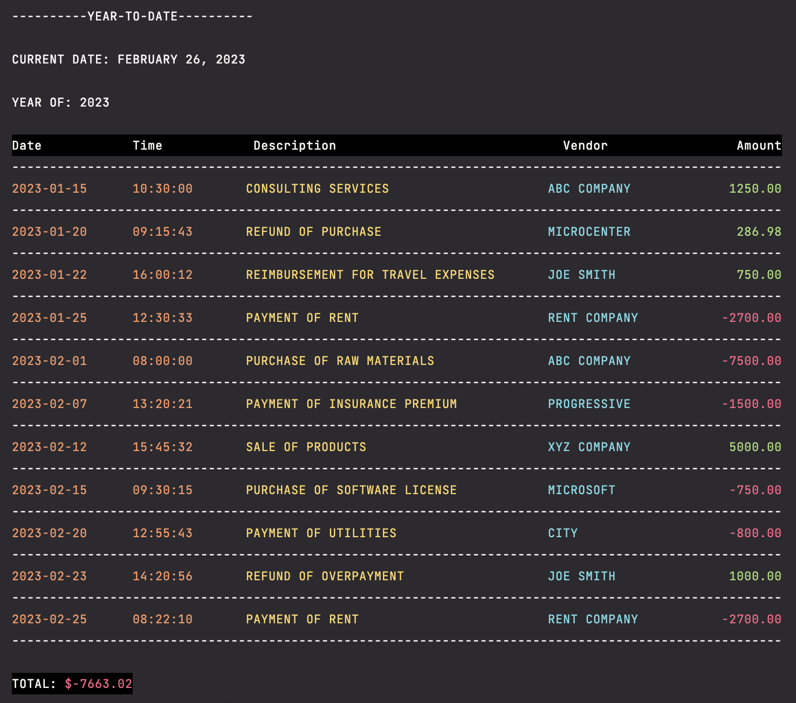

# AccountingLedger

**AccountingLedger** is a simple app for tracking deposits and payments in a CSV file.
It allows you to add new entries, view them in a ledger, and generate various reports.

## Features
- Add new deposits and payments to CSV file with date, time, description, vendor, and amount
- View entries in the ledger (All, Deposits Only, Payments Only)
- Generate reports for month to date, previous month, year to date, previous year
- Search for entries by vendor
- Search for entries with custom filter

## Home Screen
From the **Home** screen, you can choose one of the following:
- **Add Deposit** - Add a deposit entry to the CSV file
- **Make Payment (Debit)** - Add a payment entry to the CSV file
- **Ledger** - Display the Ledger screen
- **Exit** - Exit the application



## Adding Deposits/Making Payments
After selecting **Add Deposit** or **Make Payment (Debit)**, you will be prompted for the following:
- Date (YYYY-MM-DD)
- Time (HH:MM:SS)
- Description
- Vendor
- Amount

If all inputs are valid, the entry will be added to the CSV file.


## Ledger Screen
On the **Ledger** screen, you can choose one of the following:
- **All** - Display all entries in the CSV
- **Deposits** - Display all deposit entries in CSV
- **Payments** - Display all payment entries in CSV
- **Reports** - Display the Reports screen
- **Home** - Go back to the Home screen


## Displaying Entries
After selecting **All** from the Ledger screen, every single entry in the CSV file will be displayed:


After selecting **Deposits** from the Ledger screen, all deposit entries will be displayed:



After selecting **Payments** from the Ledger screen, all payment entries will be displayed:



## Reports Screen
On the **Reports** screen, you can choose one of the following:
- **Month To Date** - Generate a report from the first day of the current month to the current day of the month


- **Previous Month** - Generate a report for the entire previous month


- **Year To Date** - Generate a report from the first day of the current year to the current date


- **Previous Year** - Generate a report for the entire previous year


- **Search by Vendor** - Display all entries from specified vendor


- **Back** - Go back to the Ledger screen


- **Home** - Go back to the Home screen



## Generating Reports
**NOTE:** You will be prompted for a current date (YYYY-MM-DD) when generating reports.
The CSV file is preloaded with entries from November 2022 to March 2023, so any date in that time frame will work.

### Month To Date Report
This report goes from the first day of the current month to the current day of the month (including first & current day).
Here is what it looks like:



### Previous Month Report
This report goes from the first day of the previous month to the last day of the previous month (including first & last day).
Here is what it looks like:



### Year To Date Report
This report goes from the first day of the current year to the current day of the year (including first & current day).
Here is what it looks like:



### Previous Year Report
This report goes from the first day of the previous year to the last day of the previous year (including first & last day).
Here is what it looks like:


## Search By Vendor
When searching by vendor, you'll be prompted to enter the name of the vendor.
A list of all entries containing the specified vendor will then be displayed. 

**NOTE:** You don't have to enter the full name of the vendor, partial names work as well. (See below)


## Custom Search
When performing a custom search, you will be prompted for the following:
- Start Date
- End Date
- Description
- Vendor
- Amount

If you don't want to filter by a particular category, simply enter 'X' to skip it.

**NOTE:** Just like searching by vendor, you can enter partial values for Description and Vendor and the search will find all entries that contain those specified values. (See below)


## Code I'm Proud Of
Here is my method that generates a **Month To Date** report.
I'm proud of this code for several reasons:

- I was able to handle invalid inputs for currentDate without crashing the program.


- I learned a lot about the LocalDate class with methods like:
  - withDayOfMonth()
  - getMonth()
  - getDayOfMonth()
  - getYear()
  - getDate()
  - isAfter()
  - isBefore()
  - minusDays()
  - plusDays()


- I was not taught in-depth about the LocalDate class, so I had to do a bit of my own research.
Once I got the hang of a few of the methods, the rest came pretty easy and they're pretty straight-forward.

```java
public void generateMonthToDate()
{
    LocalDate currentDate;

    // Handle invalid date
    while(true)
    {
        try
        {
            System.out.print("Enter current date: ");
            currentDate = LocalDate.parse(scanner.nextLine().strip());
            break;
        }
        catch(Exception e)
        {
            System.out.println("\nInvalid date.\n");
        }
    }
    LocalDate firstDayOfMonth = currentDate.withDayOfMonth(1);
    double totalAmount = 0.0;

    System.out.println("\n----------MONTH-TO-DATE----------\n");
    System.out.println("CURRENT DATE: " + currentDate.getMonth() + " " + currentDate.getDayOfMonth() + ", " + currentDate.getYear() + "\n");

    System.out.println("Date\t\t\tTime\t\t\tDescription\t\t\t\t\t\t\t\t Vendor\t\t\t\t\t  Amount");
    System.out.println("--------------------------------------------------------------------------------------------------------");

    for(Transaction t : transactions)
    {
        // If entry is from start of month (including the 1st) to current date (including current date)
        if(t.getDate().isAfter(firstDayOfMonth.minusDays(1)) && t.getDate().isBefore(currentDate.plusDays(1)))
        {
            printEntry(t);
            totalAmount += t.getAmount();
        }
    }

    System.out.printf("\nTOTAL: $%.2f\n", totalAmount);
}
```